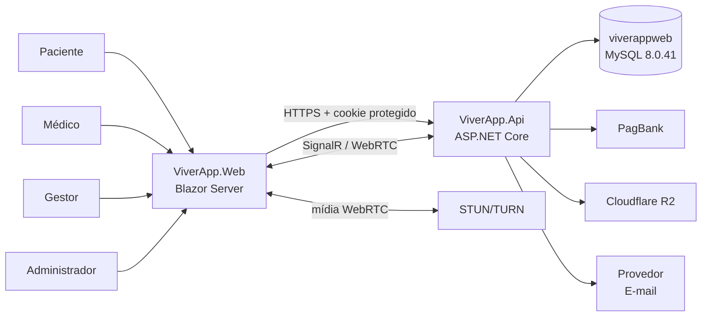
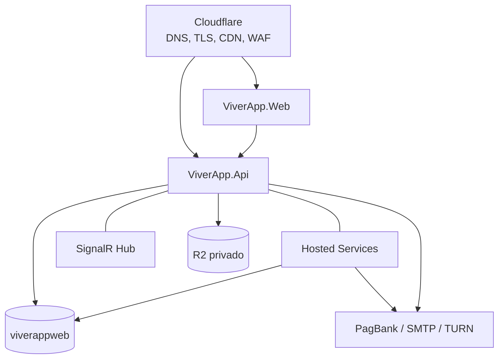
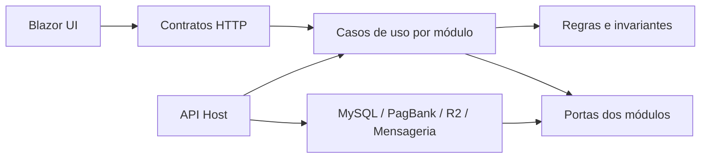
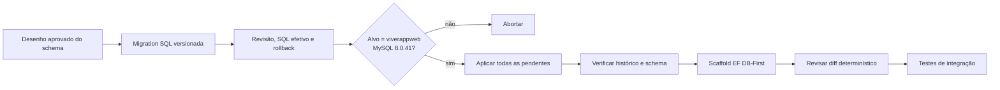
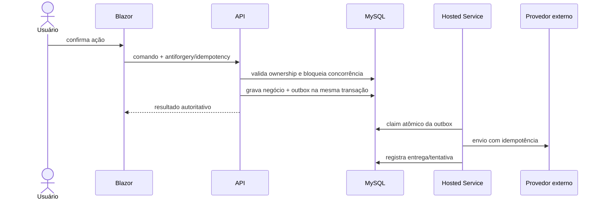
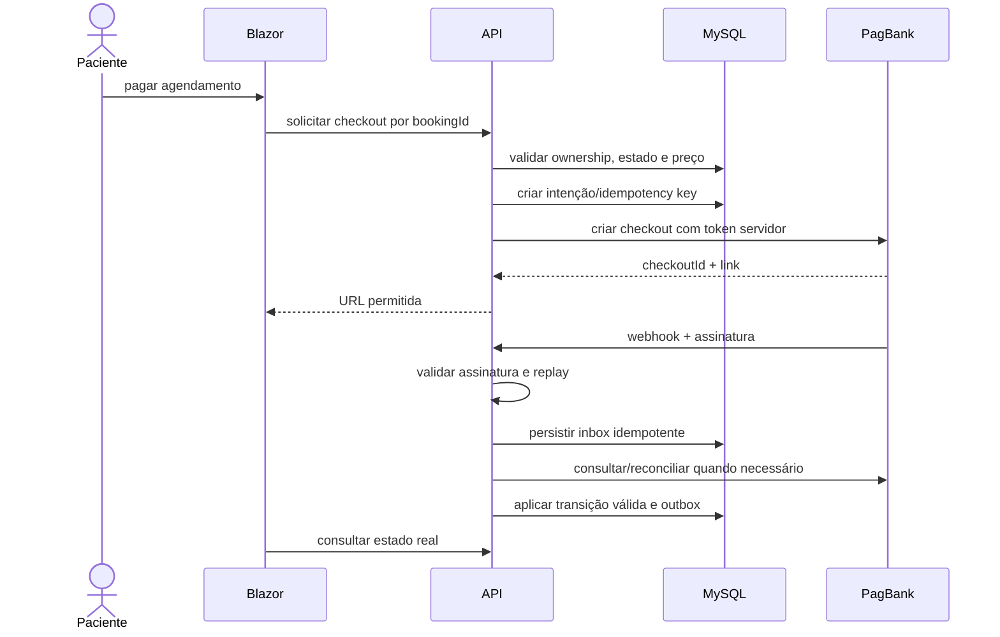

# Arquitetura alvo e diagramas

## 1. Contexto

O browser conversa com o Blazor Server. A API é a autoridade de negócio e segurança. O Blazor não abre conexão com MySQL, não carrega chave de provedor e não decide preço, papel, ownership ou transição de estado.

## 2. Containers e implantação lógica

`Hosted Services` e `SignalR Hub` são módulos internos do processo da API no começo. Sua lógica depende de interfaces e tabelas duráveis, não do lifetime do processo, permitindo extração futura.

## 3. Módulos propostos

| Módulo | Responsabilidades | Não pode fazer |
|---|---|---|
| Identidade e Acesso | contas, logins externos, hash, MFA, sessões, papéis/policies | decidir regras clínicas ou financeiras |
| Perfis e Credenciamento | dados pessoais mínimos, perfil profissional, aprovação | armazenar senha/tokens de provedor |
| Clínicas e Catálogo | clínicas, serviços, especialidades e configurações tipadas | criar agendamento sem passar pelo módulo de agenda |
| Disponibilidade e Agendamentos | slots, reservas, conflitos e ciclo do agendamento | confiar em slot/preço enviados pelo browser |
| Encontro Clínico | início/fim, relatório, feedback e vínculo de documentos | expor dado clínico fora do escopo |
| Pagamentos | checkout, tentativas, eventos, ledger e reconciliação | receber cartão ou aceitar status do cliente |
| Benefícios/Premium | solicitação, análise, vigência e desconto elegível | calcular desconto sem fonte financeira vigente |
| Documentos | metadados, autorização, scan, R2 e retenção | publicar documento sensível em CDN pública |
| Comunicação | templates, preferências, outbox e entregas | executar envio dentro da transação HTTP |
| Vídeo | grant de sala, sinalização e presença | transportar/gravar mídia sem fase específica |
| Administração e Auditoria | backoffice, auditoria, métricas e operação | ignorar segregação de função/MFA |

## 4. Dependências

- o host compõe módulos e adapters;
- módulos não referenciam o Blazor;
- adapters implementam interfaces definidas pelos módulos;
- contratos HTTP não são entidades scaffoldadas;
- módulos só se comunicam por casos de uso/eventos explícitos;
- transações não atravessam chamadas externas: outbox registra o efeito a publicar.

## 5. Fluxo DB-First obrigatório

`viverappmobile` nunca entra no caminho de escrita. O legado pode ser comparado por metadados e consultas somente leitura; `viverappweb` é o único alvo de DDL e DML do novo sistema.

## 6. Fluxo de comando transacional

## 7. Fluxo de checkout PagBank

## 8. Decisões de interface

- Blazor Interactive Server permanece a escolha inicial por manter lógica e estado sensível no servidor e reduzir superfície de tokens no browser.
- Chamadas de UI para a API devem preferir mesma origem por reverse proxy, simplificando cookies, CSP, CORS e antiforgery.
- A API continua separada como fronteira testável e potencial consumidora por integrações futuras.
- Revalidação de identidade deve considerar a duração do circuito SignalR do Blazor.
- Páginas públicas serão SSR quando útil; telas autenticadas podem usar interatividade Server por página/componente.

A documentação oficial do ASP.NET Core alerta que a autorização visível no cliente pode ser contornada e que a autenticação de Blazor Server vive no circuito; por isso toda autorização permanece na API e a sessão será revalidada. Referências: [segurança do Blazor](https://learn.microsoft.com/en-us/aspnet/core/blazor/security/?view=aspnetcore-10.0) e [antiforgery no ASP.NET Core](https://learn.microsoft.com/en-us/aspnet/core/security/anti-request-forgery?view=aspnetcore-10.0).

## 9. Evolução sem big bang

1. construir módulos novos isolados em `viverappweb`;
2. migrar dados por scripts explícitos somente quando a fase autorizar;
3. comparar invariantes e resultados com o legado em leitura;
4. ativar jornadas por feature flag e grupo controlado;
5. manter rollback durante a janela definida;
6. desativar legado apenas após reconciliação e estabilidade.

Não haverá referência binária nem projeto compartilhado entre a solution nova e `ViverApp.Shared`.
