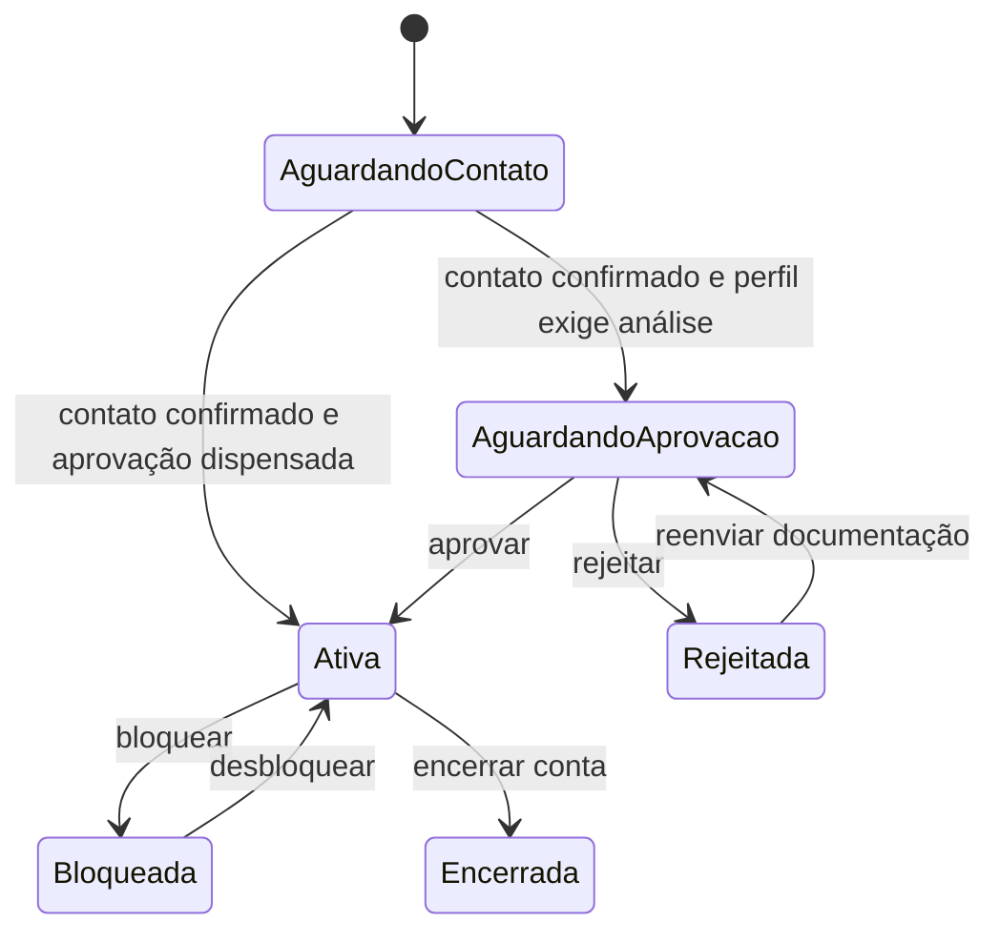
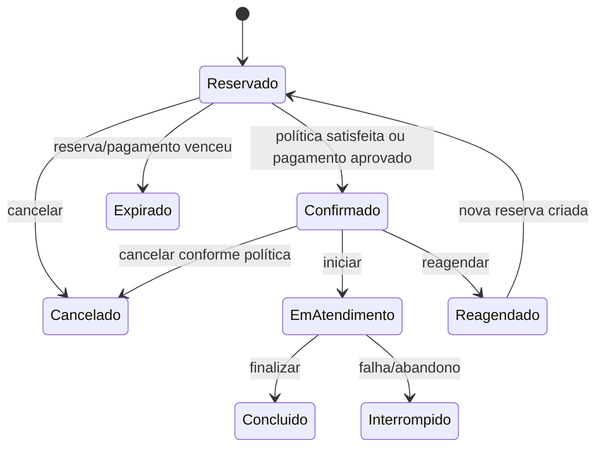
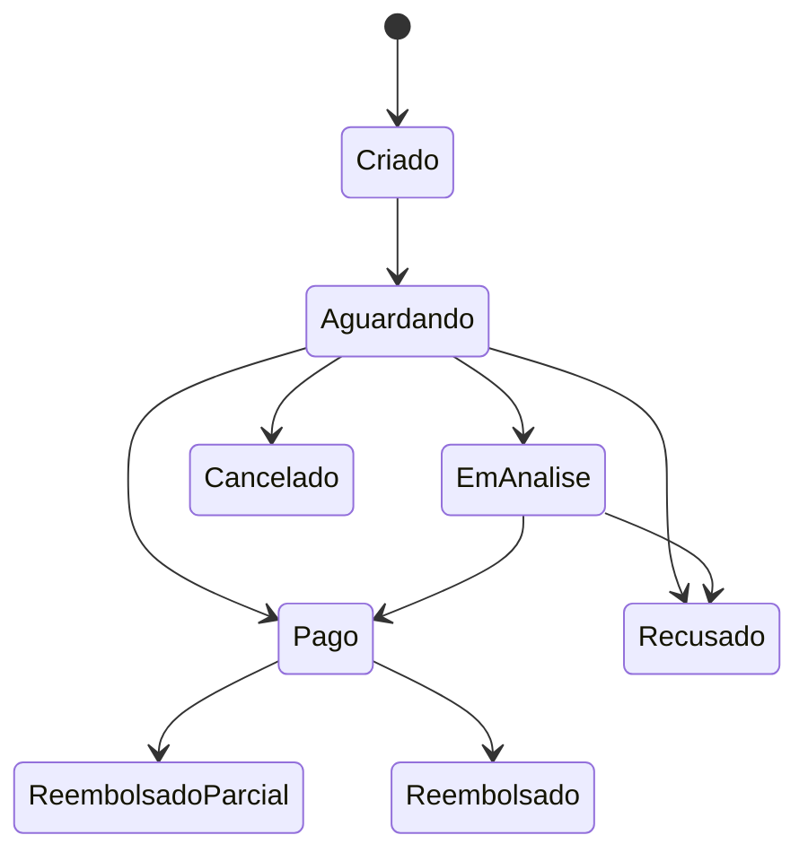
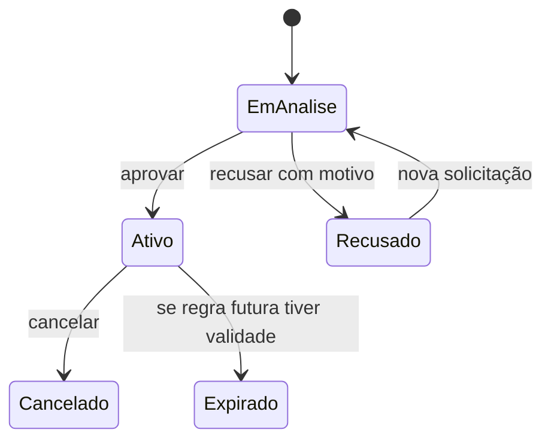

# Jornadas e requisitos funcionais

## 1. Atores

| Ator | Objetivo principal |
|---|---|
| Visitante | conhecer o serviço, entrar, cadastrar-se e recuperar acesso |
| Paciente | encontrar atendimento, agendar, pagar, consultar histórico e participar de teleconsulta |
| Médico | administrar disponibilidade, agenda, pacientes e registro do atendimento |
| Gestor | operar agenda/pacientes/pagamentos em nome da clínica dentro de seu escopo |
| Administrador | aprovar cadastros, configurar operação, auditar e acompanhar indicadores |
| PagBank | hospedar checkout e notificar mudanças financeiras |
| Provedor de e-mail | entregar mensagens transacionais por SMTP/API de e-mail |
| Cloudflare R2/CDN | armazenar e entregar objetos conforme sua classificação |

## 2. Jornada de acesso

1. O visitante escolhe entrar com Google ou com credencial local.
2. No cadastro local, informa somente os dados necessários à finalidade e confirma contato.
3. O sistema vincula um ou mais papéis à conta sem confiar em escolha privilegiada do cliente.
4. Médico/gestor aguardam análise quando a política exigir; paciente pode seguir conforme regra aprovada.
5. A sessão usa cookie seguro de servidor, é revalidada e pode ser revogada.
6. Administrador passa por MFA obrigatório e step-up em ações críticas.
7. Recuperação usa token curto, aleatório, de uso único e resposta não enumerável.

### Requisitos de acesso

| ID | Requisito |
|---|---|
| AUTH-001 | Oferecer login local e Google OpenID Connect por fluxo de servidor. |
| AUTH-002 | Usar hash adaptativo versionado e nunca armazenar senha reversível. |
| AUTH-003 | Migrar credenciais legadas por processo controlado ou forçar redefinição segura. |
| AUTH-004 | Confirmar e-mail/telefone sem revelar se uma conta existe. |
| AUTH-005 | Aplicar políticas para Paciente, Médico, Gestor e Administrador, mais ownership/escopo. |
| AUTH-006 | Exigir MFA de administrador, preferindo passkey/WebAuthn e oferecendo recuperação segura. |
| AUTH-007 | Permitir visualizar e revogar sessões/dispositivos. |
| AUTH-008 | Bloquear abuso progressivamente e auditar eventos de autenticação. |
| AUTH-009 | Vincular Google somente por fluxo explícito e e-mail verificado; nunca mesclar contas silenciosamente. |
| AUTH-010 | A API deve derivar papel e identidade da sessão, nunca de parâmetros enviados pelo cliente. |

## 3. Jornada do paciente

1. Visualiza próximos atendimentos, pendências e atalhos.
2. Escolhe modalidade, serviço e médico elegível.
3. Consulta slots calculados pelo servidor a partir de disponibilidade, clínica, feriados, duração e conflitos.
4. Confirma agendamento; a API recalcula preço/desconto e reserva o slot atomicamente.
5. Para cobrança online, recebe um checkout PagBank criado no backend.
6. Acompanha pagamento pelo estado confirmado no servidor, não pela página de retorno.
7. Pode reagendar/cancelar dentro da política, acessar rota/teleconsulta, anexos e relatório autorizado.
8. Após conclusão, pode avaliar o atendimento.
9. Pode solicitar benefício premium com documento e acompanhar a análise.

| ID | Requisito |
|---|---|
| PAT-001 | Listar serviços/médicos disponíveis com filtros e paginação. |
| PAT-002 | Exibir somente slots válidos e impedir double booking por constraint/transação. |
| PAT-003 | Calcular preço, taxa e desconto exclusivamente no servidor. |
| PAT-004 | Separar estados do agendamento e do pagamento. |
| PAT-005 | Permitir agenda futura, histórico, detalhes, cancelamento e reagendamento autorizados. |
| PAT-006 | Permitir upload/download privado de anexos vinculados ao atendimento. |
| PAT-007 | Permitir acesso à teleconsulta apenas na janela e sala autorizadas. |
| PAT-008 | Permitir avaliação somente após atendimento concluído e uma vez por política definida. |
| PAT-009 | Gerenciar preferências e consentimentos de comunicação. |
| PAT-010 | Solicitar/cancelar premium e acompanhar status sem expor documento publicamente. |

## 4. Jornada do médico

1. Mantém perfil profissional, CRM, especialidades/ofertas, modalidade e limites.
2. Define disponibilidade recorrente e exceções por data.
3. Consulta agenda e histórico com filtros.
4. Acessa somente pacientes relacionados por atendimento e dentro da finalidade.
5. Pode criar atendimento para paciente quando a política permitir.
6. Inicia teleconsulta autorizada.
7. Conclui atendimento, registra relatório e anexos e consulta feedback.

| ID | Requisito |
|---|---|
| DOC-001 | Manter credenciamento e perfil profissional com aprovação/auditoria. |
| DOC-002 | Configurar disponibilidade presencial/online sem gerar sobreposição. |
| DOC-003 | Respeitar limites diários e bloqueios administrativos. |
| DOC-004 | Listar apenas agenda e pacientes pertencentes ao escopo do médico. |
| DOC-005 | Concluir atendimento por transição válida e registrar autoria/horário. |
| DOC-006 | Proteger relatório/anexos como dados sensíveis de saúde. |

## 5. Jornada do gestor

O legado mostra capacidades próximas às do médico e algumas administrativas: gerir pacientes, criar agendamentos, cancelar/reagendar e confirmar pagamento presencial. O vínculo entre gestor e clínica não está modelado de forma clara.

| ID | Requisito |
|---|---|
| MGR-001 | Todo gestor deve possuir escopo explícito de uma ou mais clínicas. |
| MGR-002 | Acesso a pacientes, médicos, agendas e pagamentos deve ser filtrado pelo escopo. |
| MGR-003 | Criação/edição de paciente em nome da clínica deve ser auditada e evitar takeover. |
| MGR-004 | Confirmação de pagamento presencial exige permissão específica e trilha financeira. |
| MGR-005 | Ações clínicas sensíveis que pertencem somente ao médico devem ser separadas por política. |

## 6. Jornada administrativa

1. Visualiza cadastros pendentes e indicadores operacionais.
2. Aprova/reprova/bloqueia contas e habilita atendimento online.
3. Mantém clínica, catálogo, disponibilidades, feriados e configurações.
4. Acompanha agendamentos, confirma pagamentos presenciais e analisa premium.
5. Consulta notificações, auditoria, filas e métricas.
6. Usa MFA e autenticação reforçada em ações críticas.

| ID | Requisito |
|---|---|
| ADM-001 | Exigir MFA e sessão administrativa curta. |
| ADM-002 | Separar permissões por capacidade, evitando papel administrador monolítico quando possível. |
| ADM-003 | Auditar antes/depois, autor, motivo e correlação de toda ação crítica. |
| ADM-004 | Exigir confirmação reforçada em bloqueios, decisões premium e ajustes financeiros. |
| ADM-005 | Oferecer analytics paginados/agregados no servidor e com minimização de dados. |
| ADM-006 | Permitir operação de filas sem revelar payloads sensíveis ou segredos. |

## 7. Máquinas de estado propostas para validação

Elas são requisitos conceituais, não schema nem implementação.

### Conta

### Agendamento

### Pagamento

### Premium

## 8. Regras descobertas que precisam de confirmação

- e-mail e telefone parecem únicos globalmente; CPF parece único por tipo de usuário;
- conta pode ter somente um `usertype`, embora uma pessoa possa precisar de múltiplos papéis;
- pacientes criam agendamento pendente, enquanto médico/gestor criam confirmado;
- pagamentos presenciais podem ser confirmados por gestor/admin;
- premium aparenta ser vitalício quando aprovado;
- relatório médico e anexos aparecem para mais de um perfil, mas não há matriz formal de acesso;
- cancelamento possui configurações, mas a execução efetiva de prazo/política precisa ser consolidada;
- disponibilidade semanal especial é usada apenas no presencial no cálculo observado;
- feriados recorrentes são comparados por dia/mês em parte do cliente;
- clínica é frequentemente fixada com ID `1`, indicando premissa de clínica única;
- o status real do pagamento precisa comandar a confirmação, nunca o retorno visual do checkout.

Essas regras constam como decisões pendentes e não devem virar constraints de `viverappweb` sem validação.
