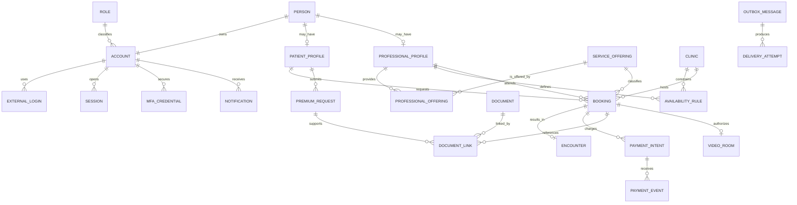

# Modelo conceitual do novo sistema

Este documento define linguagem e fronteiras, não tabelas, classes C# ou contratos finais. O schema físico será desenhado em `viverappweb` na Fase 2; somente depois haverá scaffold DB-First.

## 1. Agregados conceituais

| Área | Conceitos principais | Invariantes iniciais |
|---|---|---|
| Identidade | Conta, CredencialLocal, LoginExterno, Papel, Permissão, Sessão, FatorMFA | login externo único por issuer/subject; papel nunca vem do cliente; sessão revogável |
| Pessoa/Perfil | Conta, Contato, Endereço, PerfilPaciente, PerfilProfissional | cada conta possui exatamente um papel; CPF/e-mail/telefone normalizados |
| Clínica/Catálogo | Clínica, Especialidade, ServiçoClínico, OfertaProfissional | preço/duração/modalidade têm vigência e validação |
| Disponibilidade | RegraRecorrente, Exceção, Feriado, Slot | timezone explícito; intervalos válidos e não sobrepostos |
| Agendamento | Agendamento, ReservaDeSlot, HistóricoDeStatus | transição válida; nenhum médico ocupa slots sobrepostos |
| Encontro | EncontroClínico, Relatório, Avaliação | relatório somente após encontro; autoria e auditoria obrigatórias |
| Financeiro | IntençãoDePagamento, Checkout, EventoPagBank, Pagamento, Reembolso | valor em moeda/precisão definida; eventos idempotentes; histórico não apagado |
| Premium | SolicitaçãoPremium, Benefício, Vigência | decisão motivada/auditada; desconto calculado no servidor |
| Documentos | Documento, Versão, Scan, ConcessãoDeAcesso | objeto privado; checksum; autorização por finalidade |
| Comunicação | Template, MensagemOutbox, TentativaDeEntrega, Notificação, Preferência | negócio e outbox na mesma transação; entrega idempotente |
| Vídeo | Sala, GrantDeParticipante, Presença, EventoDeSinalização | sala ligada ao agendamento; grant curto; sem gravação padrão |
| Governança | EventoDeAuditoria, Consentimento, PedidoDoTitular, Configuração | append-only onde aplicável; dados minimizados e redigidos |

## 2. Relações conceituais

Nomes são conceituais. As cardinalidades aprovadas e o modelo DB-First da Fase 2 prevalecem sobre este diagrama.

## 3. Separações deliberadas em relação ao legado

- `user` não será uma tabela que mistura identidade, papel, preferências, endereço e perfil profissional; tokens Firebase/push não serão migrados;
- cada conta terá exatamente um papel entre Paciente, Médico, Gestor e Administrador; o papel nunca dependerá de inteiro arbitrário enviado no login;
- o sistema atenderá uma única clínica, sem tenant, associação multiclínica ou seletor de clínica;
- refresh tokens/sessões não serão guardados em texto claro quando um identificador derivado for suficiente;
- serviço clínico não será confundido com “appointment”; agendamento é outro agregado;
- estado de pagamento não será reduzido a presença de uma linha e flag `paidonline`;
- `decimal`/unidade monetária, moeda e arredondamento terão regra única;
- relatórios e anexos não serão colunas/URLs públicas sem versionamento, autorização e retenção;
- notificações in-app e tentativas de entrega externa serão conceitos diferentes;
- códigos de confirmação não dependerão de inteiros curtos persistidos em claro;
- erros técnicos não serão dados de domínio;
- flags booleanas não serão `sbyte` sem semântica;
- datas usarão UTC para instantes e timezone IANA/Windows mapeado na borda; datas civis continuarão tipos de data.

## 4. Contratos futuros

Os contratos da API deverão:

- nascer depois do schema novo e dos casos de uso aprovados;
- usar IDs opacos quando exposição sequencial aumentar risco;
- ter request/response separados de entidades EF scaffoldadas;
- omitir campos que o ator não precisa conhecer;
- declarar validação, versão, paginação e limites;
- evitar propriedades de navegação/ciclos;
- representar dinheiro e datas sem ambiguidade;
- incluir versão/ETag quando houver concorrência de edição;
- usar comandos específicos em vez de `PUT` massivo para aprovar, bloquear, pagar ou concluir.

## 5. Classificação preliminar de dados

| Classe | Exemplos | Proteção mínima |
|---|---|---|
| Pública | catálogo público, endereço comercial aprovado | integridade, cache controlado |
| Interna | configurações operacionais, métricas agregadas | autenticação e menor privilégio |
| Pessoal | nome, e-mail, telefone, endereço, data de nascimento, CPF | criptografia, minimização, auditoria e retenção |
| Sensível de saúde | relatório, anexos clínicos, plano de saúde, vínculo/agenda inferindo cuidado | autorização por finalidade, R2 privado, auditoria forte e acesso limitado |
| Financeira | pagamento, autorização parcial, status, reembolso | integridade, idempotência, segregação e retenção legal |
| Autenticação | hash, sessão, MFA, recovery code, OAuth subject | hashing/proteção forte, jamais em logs ou analytics |

## 6. Questões restantes para o domínio

- CPF deve ser único por pessoa, por papel ou globalmente?
- serviço, especialidade e tipo de atendimento são três conceitos distintos?
- preço pertence ao serviço, à oferta do profissional, à clínica ou a uma tabela de vigência?
- consultas atravessam fusos diferentes?
- qual janela de bloqueio/reserva antecede o checkout?
- premium é vitalício, assinatura ou benefício verificado periodicamente?
- quais documentos podem ser vistos por paciente, médico, gestor e admin?
- quais prazos legais/contratuais de retenção se aplicam a registros clínicos e financeiros?

Nenhuma dessas decisões será presumida na Fase 2.
