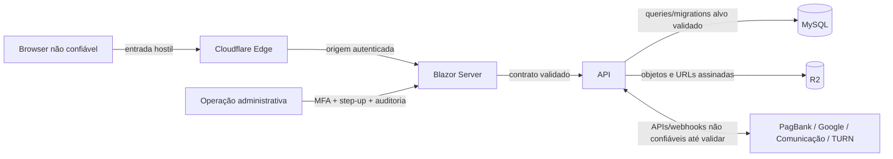

# Threat model, segurança e LGPD

## 1. Escopo e premissas

Este é um levantamento técnico preliminar, não parecer jurídico nem pentest. Ele cobre navegador/Blazor, API, MySQL, workers, SignalR/WebRTC, PagBank, storage e provedores de comunicação. A revisão deve ser atualizada em toda fase que introduzir fronteira ou dado novo.

## 2. Ativos prioritários

1. credenciais, hash de senha, sessões, MFA e recovery codes;
2. CPF, contato, endereço e data de nascimento;
3. agenda, vínculo com profissional e demais dados que possam revelar cuidado de saúde;
4. relatórios médicos, anexos e documento de plano de saúde;
5. valores, pagamentos, autorizações, reembolsos e webhooks;
6. chaves PagBank, MySQL, R2, OAuth, SMTP e TURN; credenciais legadas de SMS/Firebase devem ser desativadas, não migradas;
7. permissões administrativas e trilha de auditoria;
8. disponibilidade do sistema, agenda e filas.

## 3. Fronteiras de confiança

Toda seta cruza uma fronteira. Nem Cloudflare, nem o Blazor, nem um webhook, nem um papel apresentado pela UI substituem autorização dentro do caso de uso da API.

## 4. Achados no legado permitido

Valores secretos não são reproduzidos neste documento.

| ID | Severidade | Evidência observada | Risco | Tratamento planejado |
|---|---|---|---|---|
| SEC-001 | Crítica | credenciais Backblaze B2 estão literais no código da API | leitura/escrita/exclusão de documentos | rotacionar; R2 com segredo externo e menor privilégio |
| SEC-002 | Crítica | senhas são AES/ECB reversíveis com chave constante no código | comprometimento de todas as senhas | hash adaptativo + migração controlada + descarte da chave |
| SEC-003 | Crítica | refresh aceita `UserType` do cliente para emitir role, inclusive Admin | elevação de privilégio | papel somente do banco/sessão e policy server-side |
| SEC-004 | Crítica | quase todos os controllers carecem de policies/ownership explícitos | IDOR e acesso cruzado a pacientes/documentos/pagamentos | deny-by-default + policies e testes por recurso |
| SEC-005 | Crítica | webhook PagBank não valida autenticidade e marca pagamento sem checar rigorosamente status/valor recebido | fraude, replay e confirmação indevida | SHA-256 conforme PagBank, inbox idempotente, estado/valor e reconciliação |
| SEC-006 | Crítica | arquivos Firebase/segredos aparecem no projeto e em saídas publicadas | envio indevido de push/comprometimento do projeto legado | revogar/desativar; Firebase não será migrado |
| SEC-007 | Alta | checkout aceita do cliente itens, valores e URLs | manipulação de preço/destino | receber somente ID de negócio e calcular tudo no servidor |
| SEC-008 | Alta | upload confia em nome/tamanho/tipo do cliente e storage produz URL pública | malware, overwrite, enumeração e vazamento de saúde | limites, sniffing, scan/quarentena, chave opaca e storage privado |
| SEC-009 | Alta | VideoHub é anônimo, aceita qualquer sala/sinal e origem produtiva | invasão de sala, abuso e DoS | autenticação, grant efêmero, schema, rate limit e origem fechada |
| SEC-010 | Alta | issuer/audience JWT não são validados e HTTPS metadata está desabilitado | aceitação indevida e configuração insegura | sessão/cookie BFF; validação completa para tokens necessários |
| SEC-011 | Alta | allowlist do middleware usa `Contains` no path | bypass por path construído | metadata de endpoint/policies, nunca substring |
| SEC-012 | Alta | recuperação revela existência da conta e envia senha temporária | enumeração e interceptação | resposta uniforme e token único curto |
| SEC-013 | Alta | alteração de senha usa ID do body sem prova de ownership visível | troca de senha de outra conta | identidade da sessão e step-up |
| SEC-014 | Alta | senha/chave fallback JWT e senha de certificado aparecem em código | assinatura/HTTPS comprometidos | remover fallback, rotacionar e externalizar |
| SEC-015 | Alta | exceções internas são retornadas ao cliente e podem ser persistidas com PII | vazamento de estrutura/segredo/dados | Problem Details genérico e logs redigidos |
| SEC-016 | Alta | conta admin é inferida por endereço literal e role solicitada | lógica frágil e escalada | role persistida/policy/segregação/MFA |
| SEC-017 | Média/Alta | CORS da API aceita qualquer origem; hub aceita qualquer origem com credenciais em produção | chamadas cross-origin e sequestro de contexto | mesma origem e allowlist exata |
| SEC-018 | Média/Alta | endpoints listam entidades/coleções completas | excesso de dados, DoS e mass assignment | contratos mínimos, paginação e limites |
| SEC-019 | Média/Alta | cálculo de slot/desconto/preço acontece no MAUI | adulteração e inconsistência | cálculo autoritativo transacional na API |
| SEC-020 | Média/Alta | workers legados de e-mail/push não possuem claim uniforme/atômico | duplicidade ou perda em múltiplas instâncias | novo worker somente de e-mail com outbox, lease/claim atômico e idempotência; remover push |
| SEC-021 | Média | estado do hub está apenas em memória | presença inconsistente e perda em restart | backplane/estado distribuído com TTL |
| SEC-022 | Média | devtools e permissões de mídia automáticas são configuráveis no cliente | exposição e consentimento insuficiente | consentimento explícito e devtools fora de produção |
| SEC-023 | Média | licença de componente aparece literal no MAUI | abuso/licenciamento | rotacionar/revalidar; não copiar para web |
| SEC-024 | Média | timestamps misturam local, UTC e ajuste manual de fuso | auditoria/expiração incorreta | UTC e timezone explícito |
| SEC-025 | Média | logs/mensagens incluem nomes, arquivos, contatos e detalhes | exposição secundária de PII/saúde | classificação e redação estruturada |

Credenciais existentes no legado devem ser consideradas potencialmente comprometidas porque aparecem em fonte, arquivos de configuração ou artefatos de publicação. Rotação é uma ação externa e precisa de autorização do usuário, mas deve ocorrer antes da entrada em produção.

## 5. STRIDE e controles

| Categoria | Cenários principais | Controles obrigatórios |
|---|---|---|
| Spoofing | credential stuffing, roubo de sessão, login Google forjado, ingresso em sala | hash forte, MFA, cookie seguro, OIDC state/nonce, revalidação, grants curtos |
| Tampering | preço alterado, webhook modificado, migration no banco errado, arquivo adulterado | cálculo servidor, assinatura/hash, idempotência, checksum, confirmação do database alvo |
| Repudiation | admin nega aprovação/bloqueio, pagamento/reembolso sem autoria | audit log append-only, correlação, ator, motivo, antes/depois e horário UTC |
| Information disclosure | IDOR, documento público, logs com relatório/token, analytics excessivo | ownership, R2 privado, contratos mínimos, redação, criptografia e retenção |
| Denial of service | login/reset/upload/checkout/hub/slots caros, filas presas | rate limit por risco, quotas, tamanho/timeout, circuit breaker, backpressure e alertas |
| Elevation of privilege | role do cliente, gestor fora da clínica, admin sem step-up | policies por capacidade/escopo, role servidor, segregação, MFA e testes negativos |

## 6. Baseline de controles por superfície

### Browser e Blazor

- cookie `Secure`, `HttpOnly`, `SameSite` apropriado e chave Data Protection compartilhada/rotacionada;
- antiforgery em toda mutação autenticada por cookie;
- CSP restrita, nonces/hashes, sem HTML cru não sanitizado;
- revalidação de sessão durante circuitos Blazor longos;
- nenhuma credencial/token sensível em `localStorage` ou `sessionStorage`;
- foco, mensagens e respostas de segurança sem enumeração.

### API

- fallback policy autenticada e exceções anônimas explícitas;
- autorização por policy + ownership/clinic scope em cada caso de uso;
- rate limit separado para login, reset, consulta, upload, checkout, webhook e hub;
- validação de entrada, tamanho, content type, URL e saída;
- Problem Details genérico e correlation ID;
- idempotência, concorrência otimista/locks e transações pequenas;
- OpenAPI sem expor endpoints operacionais internos em produção.

### Banco e migrations

- MySQL 8.0.41, conta de runtime sem DDL e conta de migration separada;
- assertion obrigatória de `SELECT DATABASE()` igual a `viverappweb` antes de escrita;
- `viverappmobile` com acesso somente leitura na descoberta;
- backup/restore, histórico de migration, criptografia de trânsito e queries parametrizadas;
- dados sintéticos fora de produção e nenhuma cópia indiscriminada de dados de saúde.

### PagBank

- token somente backend, homologação antes de produção e idempotency key;
- `reference_id` opaco e não suficiente sozinho para autorizar ação;
- autenticar webhook pelo procedimento oficial SHA-256 vigente;
- persistir inbox antes de processar, rejeitar replay e tolerar ordem arbitrária;
- validar status, moeda, valor, conta e vínculo; reconciliar pela API oficial;
- página de retorno apenas informa andamento e consulta estado interno.

As referências oficiais atuais distinguem notificações de checkout e de pagamento e exigem confirmação de origem/integridade: [Checkout PagBank](https://developer.pagbank.com.br/docs/checkout), [criar checkout](https://developer.pagbank.com.br/reference/criar-checkout) e [webhooks de Checkout](https://developer.pagbank.com.br/reference/webhooks-checkout).

### Cloudflare R2

- buckets privados por ambiente e credenciais mínimas/rotacionáveis;
- URL pré-assinada curta tratada como bearer token;
- documentos de saúde não passam por domínio público/cache;
- domínio/CDN somente para conteúdo realmente público e com purga após alteração/exclusão;
- validação de upload, checksum, antivírus, quarentena e lifecycle.

A documentação do R2 informa que URLs pré-assinadas usam o domínio S3, não o domínio customizado, e que conectar custom domain torna o bucket publicamente acessível; isso impede tratar CDN pública e documentos privados como o mesmo caminho: [presigned URLs](https://developers.cloudflare.com/r2/api/s3/presigned-urls/) e [cache com R2](https://developers.cloudflare.com/cache/interaction-cloudflare-products/r2/).

## 7. Autenticação Google

O fluxo alvo é Authorization Code no servidor. Deve validar `state`, `nonce`, issuer, audience, assinatura, expiração e `email_verified`; o identificador estável é `iss + sub`, não o e-mail. Vínculo com conta local existente exige usuário já autenticado ou confirmação reforçada, evitando takeover por coincidência de e-mail.

O Google recomenda o fluxo de servidor e a validação de `state`; a referência também documenta `nonce` e discovery: [Google OpenID Connect](https://developers.google.com/identity/openid-connect/openid-connect). ASP.NET Core 10 oferece suporte de Identity e login externo, além de passkeys como opção moderna: [external providers](https://learn.microsoft.com/en-us/aspnet/core/security/authentication/social/?view=aspnetcore-10.0).

## 8. LGPD — inventário preliminar

Dados referentes à saúde são dados pessoais sensíveis na LGPD. O sistema observado trata ou pode inferir:

- identidade e contato: nome, e-mail, telefone, CPF, nascimento e endereço;
- saúde: especialidade/profissional consultado, agenda, modalidade, relatório, anexos e plano de saúde;
- financeiro: valor, meio/status, autorização parcial e histórico;
- autenticação/dispositivo: senha, tokens, device token, MFA, IP e eventos;
- comunicação: consentimento/preferência, conteúdo e tentativas de entrega;
- vídeo: sala, participantes, horário e dados técnicos; não gravar mídia por padrão.

Para cada finalidade, o proprietário/controlador deverá validar base legal, transparência, necessidade, compartilhamentos, retenção e direitos do titular. A lei define dado de saúde como sensível e estabelece princípios como finalidade: [texto oficial da LGPD](https://www.planalto.gov.br/ccivil_03/_ato2015-2018/2018/lei/l13709compilado.htm).

### Registro de tratamento necessário

| Finalidade | Dados mínimos | Destinatários | Retenção | Pendência |
|---|---|---|---|---|
| criar/segurar conta | contato, identificadores e hash | operação/Google se escolhido | definir | base legal e prazo |
| prestar atendimento | perfil, agenda e registro clínico | paciente/profissional/clínica | definir com assessoria | sigilo e obrigação profissional |
| cobrar | identificador, valor e estado | PagBank/financeiro | definir legal/fiscal | política de reembolso |
| entregar comunicação | e-mail, preferência e template | SMTP | curta e definida | consentimento/opt-out |
| analisar premium | identificação e documento | equipe autorizada | definir | necessidade do documento |
| proteger/auditar | IP, ator, evento e correlação | segurança/operação | proporcional | política de acesso |

## 9. Incidentes e resposta

O runbook deve incluir detecção, contenção, preservação de evidência, rotação, análise de impacto, restauração, comunicação e retrospectiva. A ANPD considera incidentes de confidencialidade, integridade, disponibilidade ou autenticidade e exige avaliação do risco; dados sensíveis, financeiros e de autenticação aumentam relevância: [orientação oficial da ANPD](https://www.gov.br/anpd/pt-br/canais_atendimento/agente-de-tratamento/comunicado-de-incidente-de-seguranca-cis).

## 10. Critério de segurança para lançamento

- matriz baseada no OWASP ASVS vigente, com alvo inicial Level 2 e requisitos adicionais de alto risco;
- nenhum achado crítico/alto aberto;
- pentest independente cobrindo API, Blazor, IDOR, uploads, PagBank, SignalR e infraestrutura;
- restore de backup e resposta a incidente ensaiados;
- segregação de ambientes e credenciais comprovada;
- revisão técnica e jurídica de privacidade concluída.

Referência-base: [OWASP Application Security Verification Standard](https://owasp.org/www-project-application-security-verification-standard/).
